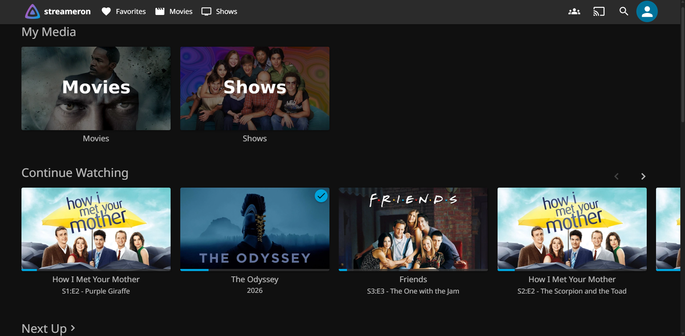
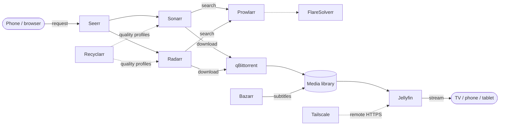
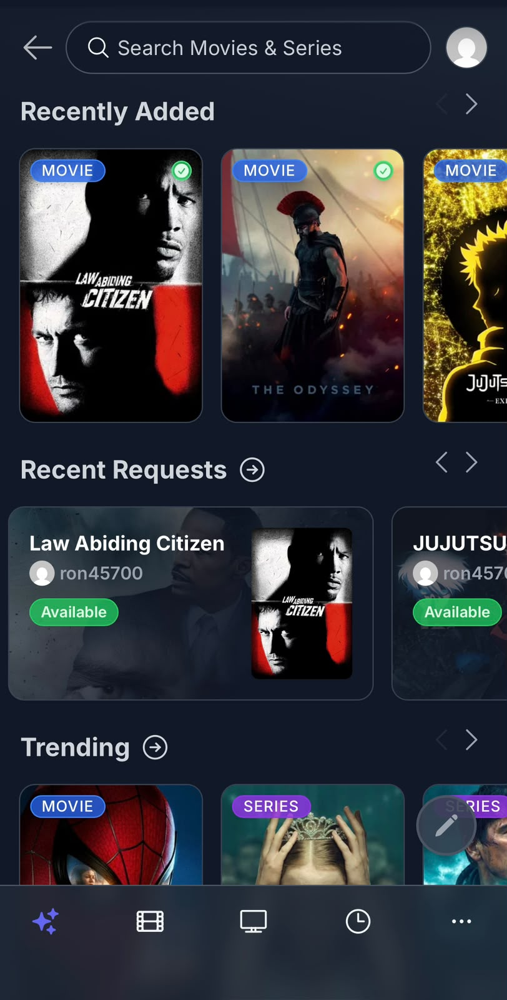

<h1 align="center">streameron</h1>

<p align="center">
  Self-hosted home media server.<br>
  Request from your phone → auto-download → auto-organize → watch on the TV.
</p>

<p align="center">
  
  
  
  
</p>

<p align="center">
  
</p>

streameron doesn't reinvent anything. It is one `docker-compose.yml` that wires a set of
excellent open-source projects into a single flow, plus the notes on how and why.

## How it works



1. You search and request a show or movie in **Seerr**.
2. **Sonarr** (TV) or **Radarr** (movies) finds a release through **Prowlarr** and hands it to **qBittorrent**.
3. The finished download is imported into the library, renamed, and **Bazarr** fetches subtitles.
4. It shows up in **Jellyfin**, ready to play at home or remotely over **Tailscale**.

<p align="center">
  <br>
  <sub>Requesting from the phone with Seerr</sub>
</p>

## Components

| Tool | Role | Port |
|---|---|---|
| Jellyfin | Media server: streams the library to TVs, phones and tablets | `8096` |
| Seerr | Request UI: search and request; feeds Sonarr/Radarr | `5055` |
| Sonarr | Tracks TV shows and grabs missing episodes | `8989` |
| Radarr | Same as Sonarr, for movies | `7878` |
| Bazarr | Subtitles (Hebrew + English) for everything Sonarr/Radarr import | `6767` |
| Prowlarr | One place to manage indexers for Sonarr/Radarr | `9696` |
| qBittorrent | Download client | `8080` |
| FlareSolverr | Helper Prowlarr calls for indexers behind Cloudflare | `8191` (API only) |
| Recyclarr | Syncs Sonarr/Radarr quality profiles with TRaSH Guides, daily | no UI |
| Tailscale | Remote access to Jellyfin, no router ports opened | no UI |

Open any of them at `http://<host>:<port>`: `localhost` on the host itself, the host's LAN IP
from other devices at home.

## Quick start

Requires Docker with Docker Compose.

```bash
git clone https://github.com/ron45700/streameron.git
cd streameron
cp .env.example .env        # then edit it, see Configuration below
docker compose up -d
```

Under `MEDIA_ROOT`, create `media/shows`, `media/movies` and `torrents` before the first start.

The containers come up empty. The one-time wiring between the apps (download client, indexers,
root folders, Seerr and Bazarr connections) is described step by step in the
[build log](docs/build-log.md).

## Configuration

Everything machine-specific lives in `.env` (git-ignored). `.env.example` documents each value.

| Variable | What it is |
|---|---|
| `PUID`, `PGID`, `TZ` | User/group the containers run as, and the timezone |
| `CONFIG_ROOT` | Each app's settings and database. Small, many writes: put it on a fast drive |
| `MEDIA_ROOT` | The library and downloads (`media/` and `torrents/` side by side): put it on the big drive |
| `SONARR_API_KEY`, `RADARR_API_KEY` | Used by Recyclarr |
| `TS_AUTHKEY` | Tailscale auth key, only needed for the first login |
| `OPENVPN_USER`, `OPENVPN_PASSWORD` | Only if the VPN is enabled |

Container paths (`/config`, `/media`, `/downloads`) are the same in every service, so the host
paths can change without touching any app setting.

## Remote access

No ports are opened on the router. A dedicated Tailscale machine named `jellyfin` serves **only**
Jellyfin over HTTPS, and that single machine is what gets shared with friends. Full access to
every service stays with the host's own Tailscale client.

Setup and details: [docs/remote-access.md](docs/remote-access.md).

## More docs

| Doc | What's in it |
|---|---|
| [Build log](docs/build-log.md) | How the stack was built stage by stage, with the first-run wiring of each app |
| [Remote access](docs/remote-access.md) | Tailscale setup, sharing with friends, checking stream quality |
| [Moving hosts](docs/moving-hosts.md) | Moving the whole stack to another machine without losing settings |
| [VPN](docs/vpn.md) | Enabling the pre-wired Gluetun VPN for qBittorrent |

## Roadmap

- [x] Jellyfin, with Direct Play verified on the target TVs
- [x] qBittorrent + Prowlarr + FlareSolverr
- [x] Sonarr + Radarr
- [x] Seerr, Bazarr, Recyclarr
- [x] Separate config and media roots
- [x] Remote access with Tailscale
- [ ] **Maintainerr**: rule-based cleanup of watched or stale media, with a grace period before deletion
- [ ] VPN for qBittorrent (Gluetun, pre-wired and disabled)

## Built with

streameron is only the glue. All the real work is done by these projects:

| Project | Used for |
|---|---|
| [Jellyfin](https://github.com/jellyfin/jellyfin) | Media server |
| [Seerr](https://github.com/seerr-team/seerr) | Requests |
| [Sonarr](https://github.com/Sonarr/Sonarr) | TV automation |
| [Radarr](https://github.com/Radarr/Radarr) | Movie automation |
| [Prowlarr](https://github.com/Prowlarr/Prowlarr) | Indexer management |
| [Bazarr](https://github.com/morpheus65535/bazarr) | Subtitles |
| [qBittorrent](https://github.com/qbittorrent/qBittorrent) | Downloads |
| [FlareSolverr](https://github.com/FlareSolverr/FlareSolverr) | Cloudflare challenge helper |
| [Recyclarr](https://github.com/recyclarr/recyclarr) | Quality profile sync |
| [Tailscale](https://github.com/tailscale/tailscale) | Remote access |
| [Gluetun](https://github.com/qdm12/gluetun) | VPN client (optional) |

Also thanks to [LinuxServer.io](https://www.linuxserver.io/) for most of the container images,
and to [TRaSH Guides](https://trash-guides.info/) for the quality profiles.

Each project is the property of its own authors and is distributed under its own license.

## Disclaimer

This is a personal project for managing media you have the right to hold. What you download
with it is your own responsibility.
